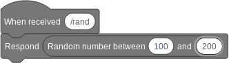
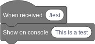
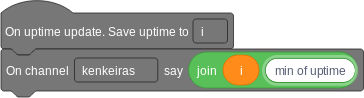

# How to build a Bridge

::: warning STABILITY NOTE
The bridge libraries are under heavy development.
Keep in mind that the usage of this libraries will change in the future.
:::

This guide will show you how to [prepare the necessary elements](#preparations) to develop new Plaza briges, 
and will show you some base examples on how to write bridges with [getter](#getter-operations), 
[operation](#operation-blocks) and [event](#event-blocks) blocks.
These blocks are shown in separate code samples for simplicity, but can be freely mixed.


## Preparations

This tutorial assumes that you know how to program in Python, and already have a basic environment setup.

First install the library to build bridges with `pip install -U plaza-bridge`

After that, log into Plaza, go to the `Bridges` section and click on `Add One!`.
Set the name of your bridge on the resulting menu (minimum of 4 characters) and click `Create`, this will
generate a new URL that you will have to copy and keep safe, this is the **Bridge endpoint**. After this you can
click on `Back` to return to the dashboard.


## Getter blocks

**Getter** blocks (or [reporter blocks](https://en.scratch-wiki.info/wiki/Reporter_Block) on Scratch) 
are blocks that cannot run independently, but allow to obtain a value that might be used on other operations.
In our case we'll build a **getter** that returns a random number given a lower and an upper bound.


```python
from plaza_bridge import (
    PlazaBridge,  # Import bridge functionality
    BlockArgument,  # Needed for argument definition
)

# Create the bridge object
bridge = PlazaBridge(name="Random number bridge")

# Define the getter
@bridge.getter(
    id="get_random_number",  # Give it an ID
    message="Random number between %1 and %2",  # Define the message on the block
    arguments=[
        BlockArgument(int, 0), # Define the two parameters, two integers
        BlockArgument(int, 100),  # with defaults of 0 and 100
    ],
    block_result_type=int,  # The result is another integer
)
def get_random_number(lower, upper, extra_data):
    # Getter logic
    import random
    return random.randint(int(lower), int(upper))

bridge.endpoint = "**insert here the bridge endpoint**" # Configure the bridge endpoint
bridge.run() # Launch the bridge
```

If we run this, we'll find a new block that we can use in our programs to retrieve values.




## Operation blocks

**Operation** blocks (or [stack blocks](https://en.scratch-wiki.info/wiki/Stack_Block) on Scratch) 
are blocks that run an independent operation, and which can be concatenated.
In our case we'll build a **operation** that prints something on the bridge console.


```python
from plaza_bridge import (
    PlazaBridge,  # Import bridge functionality
    BlockArgument,  # Needed for argument definition
)

# Create the bridge object
bridge = PlazaBridge(name="Console bridge")

# Define the getter
@bridge.operation(
    id="print_on_console",  # Give it an ID
    message="Show on console %1",  # Define the message on the block
    arguments=[
        BlockArgument(str, "Test"), # Define the parameter, a string
    ]
)
def print_on_console(data, extra_data):
    print(data)

bridge.endpoint = "**insert here the bridge endpoint**" # Configure the bridge endpoint
bridge.run() # Launch the bridge
```

If we run this, we'll find a new block that we can use in our programs to perform actions.




## Event blocks

**Event** blocks (or [hat blocks](https://en.scratch-wiki.info/wiki/Hat_Block) on Scratch) 
are blocks that sit on top of **reporter** blocks and trigger them when an event happens.
In our case we'll build a **event** that is triggered every minute.


```python

from plaza_bridge import (
    PlazaBridge,  # Import bridge functionality

    # Advanced block creation
    VariableBlockArgument,
    BlockContext,
)

# Create the bridge object
bridge = PlazaBridge(
    name="Uptime bridge",  # Bridge name
    events=["on_update"],  # Define available bridge events
)

# Extract event
on_update = bridge.events.on_update
# Define event blocks
on_update.add_trigger_block(
    id="on_update_set",
    message="On uptime update. Save uptime to %1",  # Set the message
    arguments=[VariableBlockArgument()],    # Add a slot to point to a variable
    save_to=BlockContext.ARGUMENTS[0],      # Point to the variable where is saved
)

# Parallel logic
import threading
import time
def uptime_counter():
    uptime_minutes = 0
    while True:
        time.sleep(60)
        uptime_minutes += 1

        print("Sending uptime:", uptime_minutes)
        # Send event
        on_update.send(
            to_user=None,  # Send to everyone
            content=uptime_minutes,  # Content of the event
        )

threading.Thread(target=uptime_counter).start()

# Launch bridge
bridge.endpoint = "**insert here the bridge endpoint**" # Configure the bridge endpoint
bridge.run() # Launch the bridge
```

If we run this, we'll find a new block that we can use to detect events and do something 
based on what happened.


