# How to create a weather bot

[//]: # (TODO telegram_icon)
In this tutorial we will follow the steps needed to create a Telegram chatbot.
This chatbot will send you the weather data of your city when you send it `/weather`.

If already have an account on the platform jump to [connect to the services](#connect-to-the-services)

## Table of contents

- [Welcome to PrograMaker](#welcome-to-programaker)
- [Connect to the services](#connect-to-the-services)
  - [Connecting to AEMET](#connecting-to-aemet)
  - [Connecting to Telegram](#connecting-to-telegram)
- [Create the program](#create-the-program)
  - [Preparing the program](#preparing-the-program)
  - [Build the base](#build-the-base)
  - [Completing the program](#completing-the-program)

## Welcome to PrograMaker

PrograMaker is a platform that helps you to create programs using Visual tools.

To create a program using PrograMaker. If you, already have an account you can [login here](https://programaker.com/login).
If you don't have an account, you will first need to [register here](https://programaker.com/register).

[//]: # (TODO: Should we add screenshots or a more involved procedure here? )

## Connect to the services

[//]: # (TODO Add icons)

To build this program we will use two services, the [AEMET](https://www.aemet.es/), which provides us with weather information.
And Telegram, where the chatbot will be located.

### Connecting to AEMET

There is no special requirement to connect to the AEMET service, so we can just go to [PrograMaker's main page](https://programaker.com/) and click on the `[+]` button below "My Bridges".

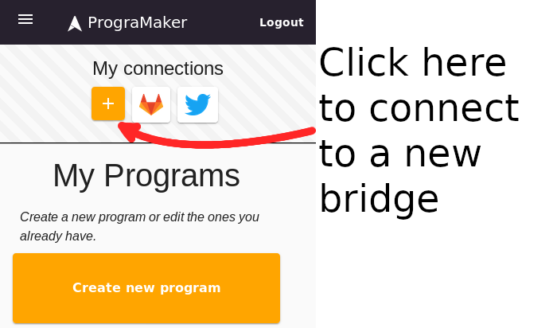

This will show a menu with the bridges that we can connect to, select "AEMET" and click on "Add connection".

[//]: # (TODO: What if we already have a connection?)

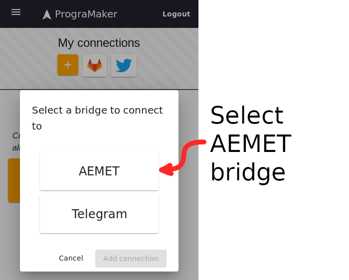

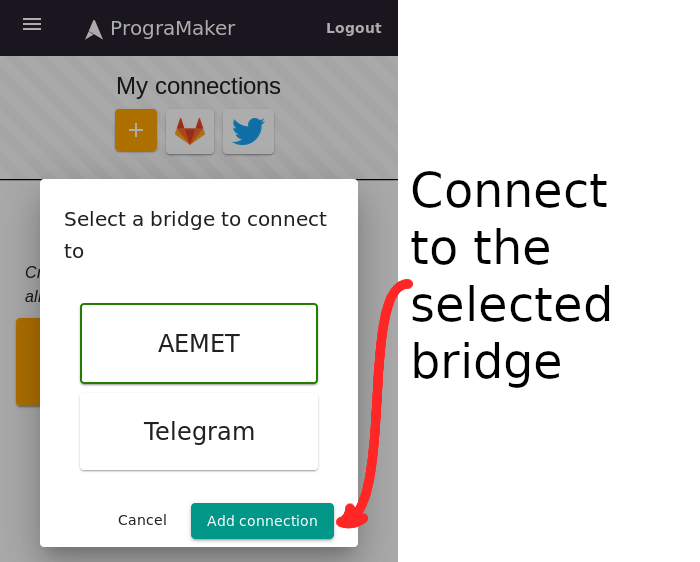

After this, we will see the AEMET bridge in "My connections"

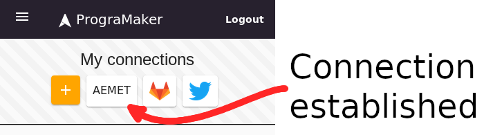

With this we are done with the AEMET bridge, now lets connect to telegram.

### Connecting to Telegram

The connection to the Telegram bridge is slightly more involved, as it requires linking with our Telegram user.

We start the same as AEMET, going to [PrograMaker's main page](https://programaker.com/) and click on the `[+]` button below "My Bridges".

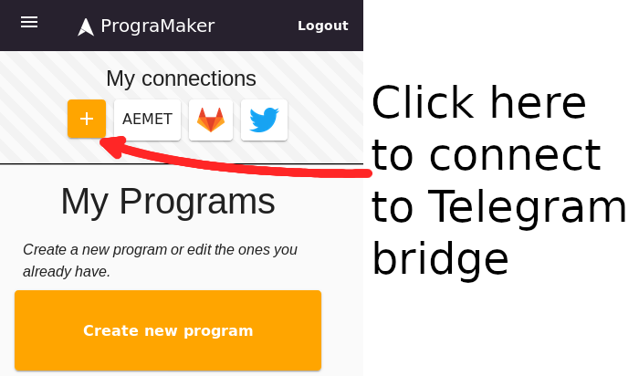

[//]: # (TODO: What if we already have a connection?)

The menu will show which bridges we can establish a new connection to, select "Telegram" here.

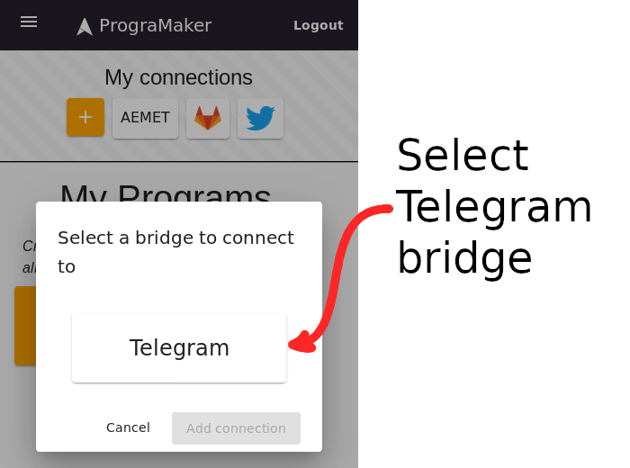

This will open a window with the instructions to connect to the Telegram bridge.

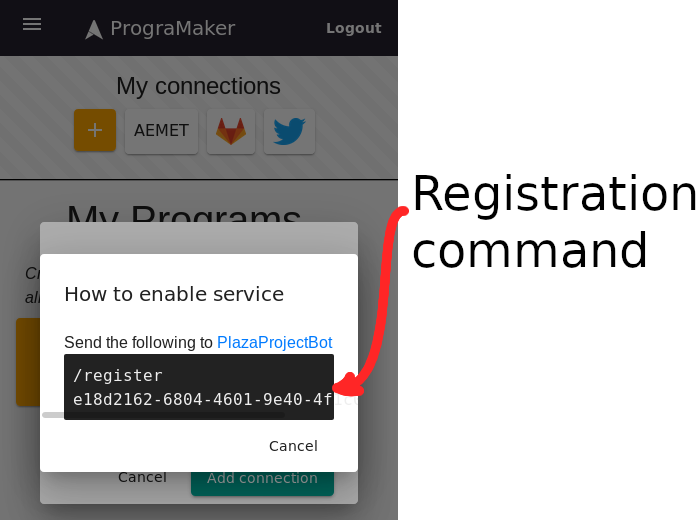

The command shown here `/register e18d2162...` (it is different each time) has to be sent to [PlazaProjectBot](https://telegram.me/PlazaProjectBot). If we have a Telegram application installed, we can click on the link to open a conversation with the Bot

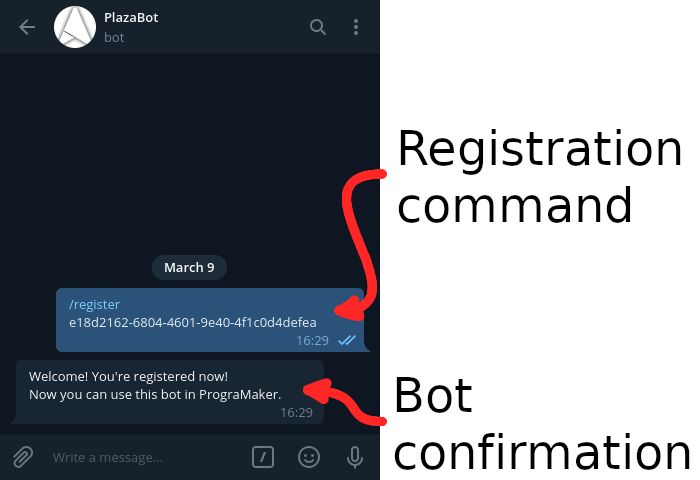

If this worked correctly, and the bot responds, now the we can see the connection to Telegram on PrograMaker.

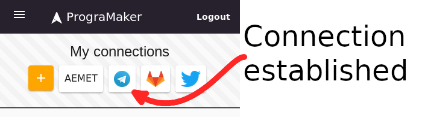

## Create the program

To create a new program, going to [PrograMaker's main page](https://programaker.com/) and click on the "Create new program" button "My Programs".

### Preparing the program

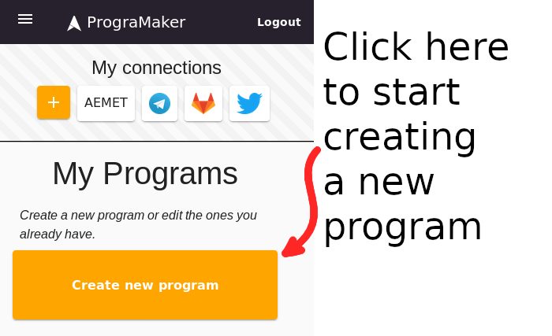

This will create a new program, scroll on the program bar and click on "Rename" to give the program a name.

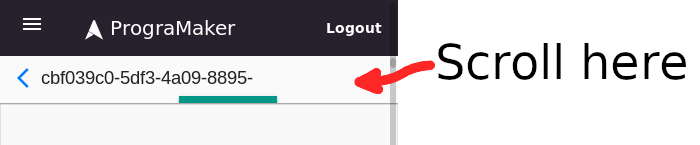

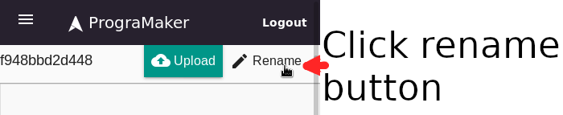

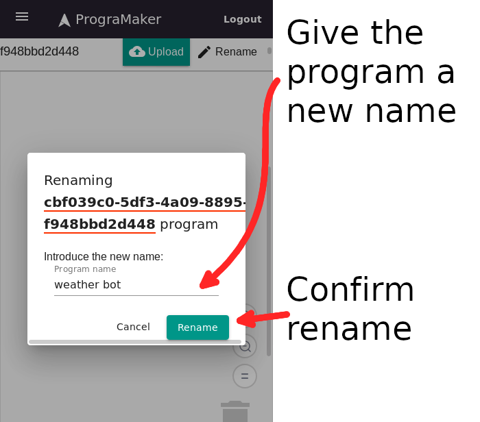

Ok, so now we are ready to write the program! Note that there's three sections on this screen.

<a name="workspace-sections" />

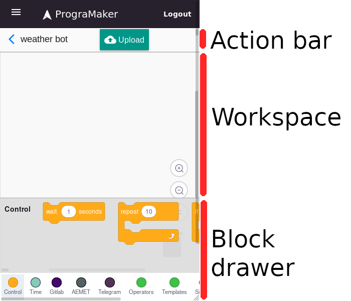

From top to bottom:
 - The **action bar** contains the buttons to operate the program.
   The most important is the **upload** button, which will upload the blocks to the platform and start or refresh the bot program.

 - The **workspace** is where we will place the blocks that control the program.
   It also contains buttons to modify the zoom level and a trashcan, where we can drop blocks to remove them.

 - The **drawer**, from where we can get new blocks to place them into the **workspace**.
   Depending on the resolution of the browser it can be placed at the bottom of the window or at the left.
   If the browser does not have enough space to show the full drawer at all times (like on smartphones), we can
   expand it by clicking on a block category (like "Control", "Time", ...), here at the bottom of the screenshot.

   Note that the **drawer** can be scrolled (horizontally in this case) to show more categories.

### Build the base

First, lets build a program that responds to the `/start` command, and responds with a simple text.
This first program will follow this diagram: 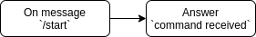

If you have already built some programs it might not much, but with this we will have the base for any program: receiving an event and responding to it :)

 

To build this program click on the Telegram category on the <a href="#workspace-sections">Block drawer</a>. It should appear as a circle like this (although the color might change) 

After clicking on the Telegram category, the drawer will show the blocks for the telegram bridge. Look for the block that detects when a text is received, then drag it into the workspace

The block: 

The result:

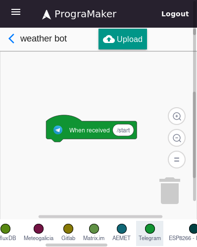

Ok! With this the program will react when we send a message with the `/start` text, next lets add a reaction.

Again we click on the Telegram category .
This time we look for a block with the message "Respond (Hello)" and drag it to the workspace, under
the "When received ..." block that we placed before.

The block: 

The result:

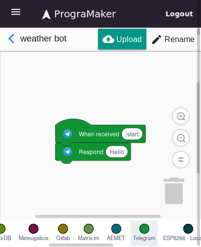

Now we can click on the text inside the "Respond (Hello)" block, and change the "Hello" text into "Command received".
After that we click on the "Upload" button to send the program to the platform and start it.

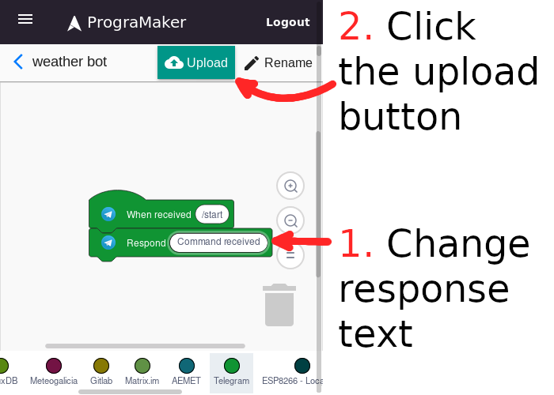

If we did this correctly, we can send `/start` to [PlazaProjectBot](https://telegram.me/PlazaProjectBot), and it should respond with the text we just set.

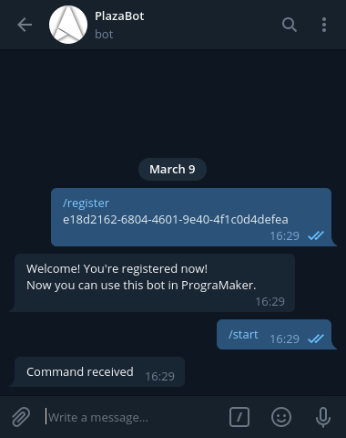

### Completing the program

So, we have a program that answers to our command, now lets use the connection with AEMET to send some weather data. The AEMET bridge gives us the maximum and minumum temperatures for a place, so we will with that.

In this case the program's diagram is a bit bigger:

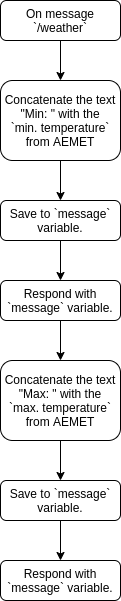

Here we see two new types of operations, "Concatenate the text ..." and "Save to ... variable". Each one can be done with a block.

- The block for "Concatenate the text ..." can be found on the Operators category 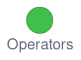 as the "Join (hello) (world)" block: 
- The block for "Save to ... variable" can be found on the Variables category  as the "Set (variable) to (0)" block: 

If we put the diagram and the blocks side by side we can start to see the shape of the final program:

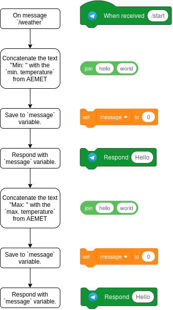

#### Variables

But first, if you check the Variables category  you will see that the block might not be there, and only a  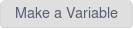 block appears.

Click the "Make a variable" block and the following dialog will appear, so we can introduce our variable name, `message`. Here we will store the message for the responses.

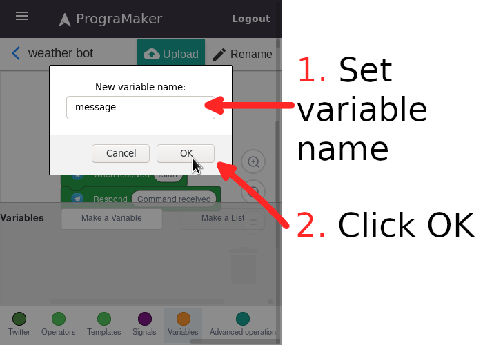

#### Mixing operations

With this in place we can now think how to build this section of the program.

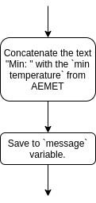

Keep in mind that the result from the first operation, "Concatenate the text ...", has to be used as input for the second operation, "Save to ...".
The key to how to do this is that the round blocks can be placed inside other blocks with round sockets.

This way we can combine the blocks like this: 

If we place this combined block in the middle of the program, we have something like this:

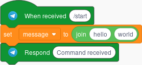

So, now that we set the variable, we can use it in the response. In the Variables category  we can find a block with the variable name: 

Inserting that block on the "Respond ..." one will replace the "Message" variable block with its content, this is the resulting program:

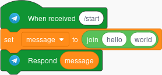

If we test this program we can see how this works. Remember to upload the changes! 

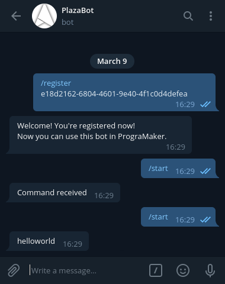

Note that this is equivalent to the same program, just replacing the variable's content directly, but variables will be useful later, when more complex programs are needed.

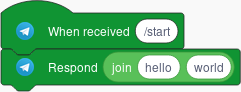

#### The final stretch

Ok, so we got to concatenate two texts and save them, now we have to set one text to the minimum temperature (according to the AEMET).
To do this, in the AEMET category   we can find a block the information: 

Drop this block on the second socket of the "Join (hello) (world)" block and click on the city name (by default Ababuj) to open the city menu.
Select the one from where you want the prediction.

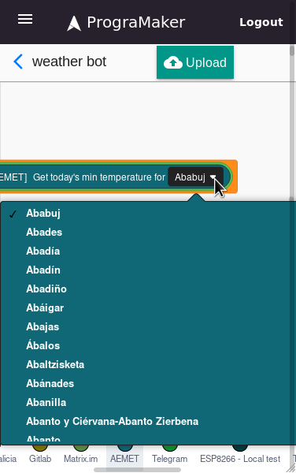

After selecting a city, we can set the first socket in the "Join (hello) (world)" to something like "Min: ", so our program is now like this:

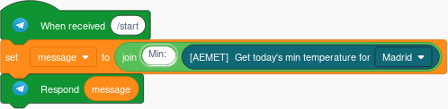

After uploading (  ) we can test the result

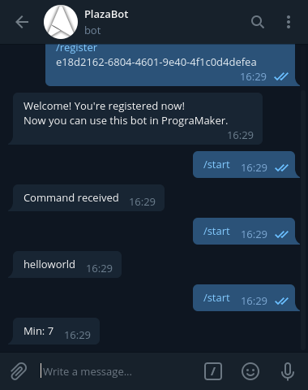

We are almost there, let's replicate the same "Set (message) to (join (Min: ) ( ... ))" and "Respond (message)" with the maximum temperatures.
Now the block we have to put inside the join is  , also from the AEMET category 

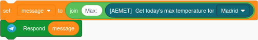

As you can see there is no problem in updating a variable, we can just add a new "Set (variable) to (...)" block and it will change it.

For the final touch, lets change the "When received (/start)" to "When received (/weather)" so we can leave the `/start` command for other purposes. And here we have the final version:

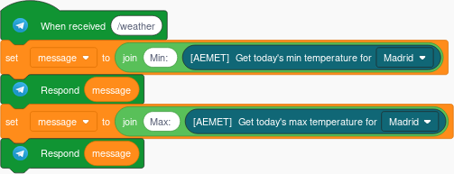

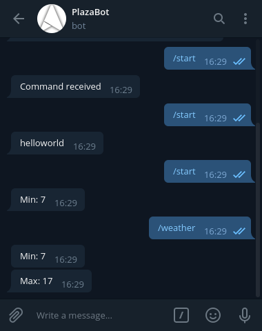_
